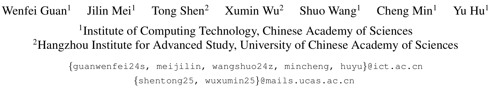
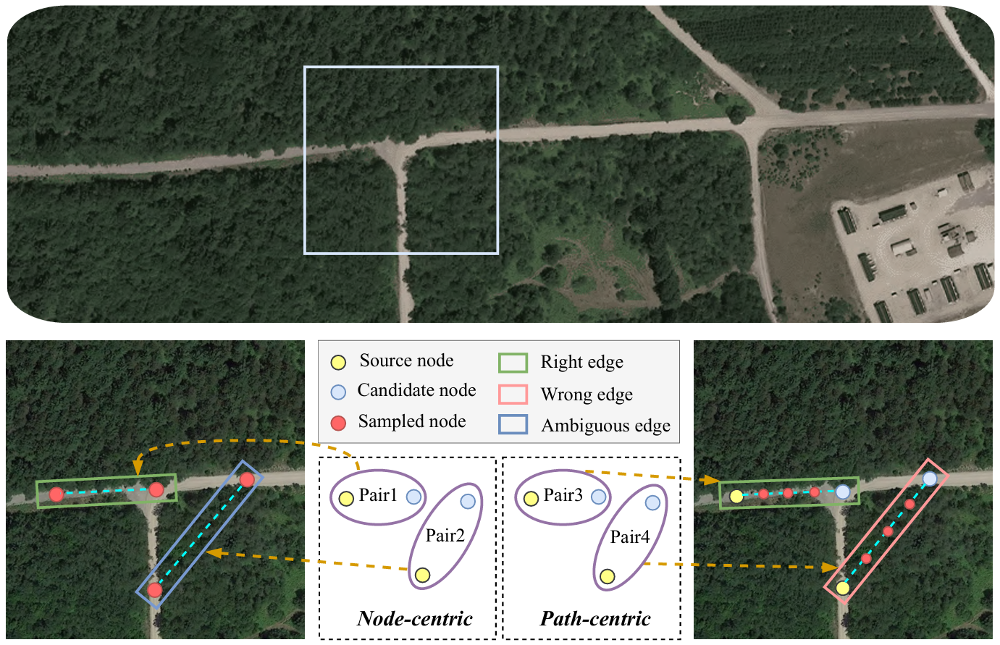

<h1 align="center">Beyond Endpoints: Path-Centric Reasoning for Vectorized Off-Road Network Extraction</h1>

<div align="center">

[](https://opensource.org/licenses/MIT)
[](https://pytorch.org/)

</div>

<div align="center">

[**[ArXiv Paper]**](#) | [**[Interactive Tool]**](#) | [**[WildRoad Dataset]**](#)

</div>

<div align="center">
  
</div>


## 📖 Introduction

**MagRoad** introduces a novel *path-centric* reasoning approach for extracting vectorized road networks, specifically designed to handle the challenges of off-road and wild environments. Unlike *node-centric* methods (sam_road series), our model focuses on the connectivity and topology of paths, enabling robust extraction in complex terrains.


<div align="center">
  
</div>

*Node-centric* models suffer from path ambiguity due to sparse features, *path-centric* sampling resolves path ambiguity by leveraging evidence along the entire edge.

**Key Features:**

- 🤖Robust Extraction Pipeline: Path-centric reasoning for reliability in complex terrains.

- 🖱️Interactive Annotation: Lightweight tool for faster, low-effort annotation and refinement.
  
- 🌍 WildRoad Dataset: A new benchmark for challenging scenarios (To be released).

## 📊 Demo

### 🤖 Automated Extraction

<div align="center">
  
</div>

MaGRoad demonstrates effective road extraction results across four diverse datasets: City-Scale, Global-Scale, SpaceNet, and WildRoad.

### 🖱️ Interactive Annotation Tool


| **Manual Annotation (QGIS)** | **Interactive Annotation (Ours)** |
|:----------------------------:|:---------------------------------:|
|  |  |

To address the bottleneck of creating large-scale vectorized datasets, we developed the **first interactive road extraction algorithm** and integrated it into a seamless **Web Application**. It transforms the workflow: instead of tedious manual plotting (e.g., QGIS), our model intelligently automates path connectivity based on sparse user clicks, drastically reducing annotation time.

> 📢 **Open Source:** The full codebase for both the interactive algorithm and the annotation tool will be released to the community.

---

## 🛠️ Quick Start

1. **Clone the repository**
   ```bash
   git clone https://github.com/xiaofei-guan/MaGRoad.git
   cd MaGRoad
   ```

2. **Environment Setup**
   ```bash
   conda create -n magroad python=3.8 # we use python 3.8.19
   conda activate magroad
   pip install -r requirements.txt
   ```
   *Note: Ensure you have PyTorch and CUDA installed compatible with your system.*

### 📥 Model Preparation

Please download the **ViT-B** checkpoint from the [official SAM repository](https://dl.fbaipublicfiles.com/segment_anything/sam_vit_b_01ec64.pth) and place it under `sam/ckpt`:

```bash
mkdir -p sam/ckpt
# Save sam_vit_b_01ec64.pth here
```

### 📂 Data Preparation

We support our new **WildRoad** benchmark (it's comming soon)  and the **[Global-Scale](https://pan.baidu.com/s/18HFMWV1VESFxZg25nCH4kw?pwd=fnku)** dataset. Please download the data and place it into the wildroad and globalscale folders, respectively.

**WildRoad Dataset:**
```bash
cd wildroad
bash preprocess_data/preprocess.sh ./wild_road ./wild_road_GLG ./wild_road_mask 16
```

**GlobalScale Dataset:**
```bash
cd globalscale
bash preprocess_data/preprocess.sh ./Globalscale ./Globalscale_GLG ./Globalscale_mask 16
```


The expected directory structures after preprocessing are shown below:

| **WildRoad Structure** | **Global-Scale Structure** |
| :--- | :--- |
| <pre>wildroad/<br>├── preprocess_data/<br>├── wild_road/       # Raw Data<br>│   ├── train_patches/<br>│   ├── val_patches/<br>│   └── test_patches/<br>├── wild_road_GLG/   # Processed Graphs<br>│   ├── train_patches/<br>│   ├── val_patches/<br>│   └── test_patches/<br>└── wild_road_mask/  # Processed Masks<br>    ├── train_patches/<br>    ├── val_patches/<br>    └── test_patches/</pre> | <pre>globalscale/<br>├── preprocess_data/<br>├── Globalscale/         # Raw Data<br>│   ├── train/<br>│   ├── val/<br>│   ├── in-domain-test/<br>│   └── out_of_domain/<br>├── Globalscale_GLG/     # Processed Graphs<br>│   ├── train_GLG/<br>│   └── out_of_domain_GLG/<br>└── Globalscale_mask/    # Processed Masks<br>    ├── train/<br>    └── out_of_domain/</pre> |

> **Note for City-Scale and SpaceNet:**
> The `main` branch is dedicated to **WildRoad** and **Global-Scale** experiments.
> To reproduce results on **City-Scale** or **SpaceNet** (following the [`sam_road`](https://github.com/htcr/sam_road) data preparation), please switch to the legacy branch:
> ```bash
> git checkout city-space
> ```

## 🚀 Usage

### 1. Training
Train the model with the specified configuration.
```bash
python train.py --config=config/toponet_vitb_1024_wild_road.yaml
# Example with resume
python train.py --config=config/toponet_vitb_1024_wild_road.yaml --resume=<your_ckpt_path>
```

### 2. Threshold
Compute the mask and topo connectivity threshold.
```bash
bash compute_threshold/test.sh --config config/toponet_vitb_1024_wild_road.yaml --checkpoint <your_ckpt_path>
```

### 3. Inference
Update mask and topo threshold
- ITSC_THRESHOLD: 0.133
  
- ROAD_THRESHOLD: 0.839
  
- TOPO_THRESHOLD: 0.373

```bash
python inferencer.py --config=config/toponet_vitb_1024_wild_road.yaml --checkpoint=<your_ckpt_path>
```

### 4. Evaluation
Evaluate the model using APLS and TOPO metrics.
```bash
# Usage: bash <script> <gt_dir> <pred_dir> <output_dir> <params...>
bash wildroad_metrics/apls_topo_parallel.sh wildroad/wild_road/test pred_dir wildroad_metrics/result/ 32 32
```

## 📝 To-Do List

- [x] Release automated extraction code (Training & Inference).
- [x] Organize and clean up dataset preparation scripts.
- [ ] Release **WildRoad** Dataset.
- [ ] Release pre-trained model checkpoints.
- [ ] Release Interactive Annotation Tool and GUI.

## 📍 Citation

If you find this work useful for your research, please cite our paper:

```bibtex
@article{magroad2025,
  title={Beyond Endpoints: Path-Centric Reasoning for Vectorized Off-Road Network Extraction},
  author={Guan, Wenfei and Mei, Jilin and Shen, Tong and Wu, Xumin and Wang, Shuo and Min, Cheng and Hu, Yu},
  journal={arXiv preprint # comming soon},
  year={2025}
}
```

## 🤝 Acknowledgements

We sincerely thank the authors of the following open-source projects for their contributions, which served as important foundations for our work:

- [**Sam_Road**](https://github.com/htcr/sam_road)
- [**Sam_Road++**](https://github.com/earth-insights/samroadplus)
- [**Sat2Graph**](https://github.com/songtaohe/Sat2Graph)
- [**Segment Anything Model**](https://github.com/facebookresearch/segment-anything)
